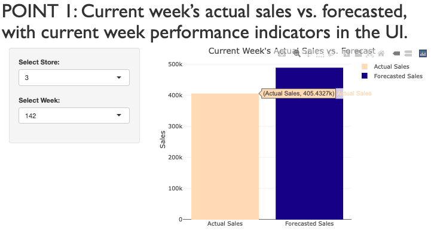

```{r setup, include=FALSE}
knitr::opts_chunk$set(echo = TRUE)
```

# [POINT 1: Current week's actual sales vs. forecasted, with current week performance indicators in the UI.]{style="font-family: Gill Sans; font-size: 40px;"}



# [POINT 2: Sales forecast for a specific future quarter (during the upcoming year) selected in the UI.]{style="font-family: Gill Sans; font-size: 40px;"}

```{r, echo=FALSE, message=FALSE, warning=FALSE}
library(shiny)
library(tidyverse)
library(forecast)
library(scales)
library(plotly)

# historical records from multiple stores
fsales <- "https://raw.githubusercontent.com/multidis/hult-inter-bus-reports-r/main/forecasting/sales_weekly.csv"
sales <- read_csv(fsales)

# UI
ui <- fluidPage(
  sidebarLayout(
    sidebarPanel(
      selectInput("storenum", label = "Select store:",
                  choices = unique(sales$Store),
                  selected = 1),
      selectInput("quarter", label = "Select future quarter:",
                  choices = c("Q1", "Q2", "Q3", "Q4"),
                  selected = "Q1"),
      actionButton("generate", label = "Generate Forecast")
    ),
    mainPanel(
      plotlyOutput("quarterPlot")
    )
  )
)

# Server
server <- function(input, output, session) {
  selectedStore <- reactive({
    req(input$storenum)
    input$storenum
  })
  
  selectedQuarter <- reactive({
    req(input$quarter)
    input$quarter
  })
  
  horizon <- reactive({
    quarter_num <- as.integer(substr(selectedQuarter(), 2, 2))
    4 - quarter_num + 1
  })
  
  # Reactive chart
  observeEvent(input$generate, {
    output$quarterPlot <- renderPlotly({
      sales_qrt <- sales %>%
        mutate(Quarter = ceiling(Week / 13)) %>%
        group_by(Store, Quarter) %>%
        summarise(Quarterly_Sales = sum(Weekly_Sales))
      
      # Filter by selected store
      sales_qrt_filtered <- sales_qrt %>%
        filter(Store == selectedStore())
      
      # Create a time series object
      sales_qrt_ts <- ts(sales_qrt_filtered$Quarterly_Sales, frequency = 1)
      
      # Build ARIMA model and forecast
      arima_model <- auto.arima(sales_qrt_ts, seasonal.test = "seas")
      arima_pred <- forecast(arima_model, h = horizon())
      
      # Create a data frame for plotting
      plot_data <- data.frame(Quarter = c(sales_qrt_filtered$Quarter, tail(sales_qrt_filtered$Quarter, n = 1) + 1:horizon()),
                              Sales = c(sales_qrt_filtered$Quarterly_Sales, as.numeric(arima_pred$mean)))
      
      # Plot actual and forecasted values
      plot <- ggplot(plot_data, aes(x = Quarter, y = Sales, color = "Forecast")) +
        geom_line(size = 0.6) +
        labs(title = "Sales Forecast for Selected Store",
             x = "Quarter",
             y = "Sales",
             Color = "Legend") +
        theme_minimal() +
        scale_y_continuous(labels = comma, name = "Sales") +
        scale_color_manual(values = c("Forecast" = "navy"))
      
      # Convert ggplot to plotly
      ggplotly(plot)
    })
  })
}
```

```{r, echo=FALSE, message=FALSE, warning=FALSE}
shinyApp(ui = ui, server = server)
```

# \# [POINT 3: Sales forecast for a given week (within the next three months) selected in the UI.]{style="font-family: Gill Sans; font-size: 40px;"}

```{r, echo=FALSE, message=FALSE, warning=FALSE}
library(shiny)
library(forecast)
library(tidyverse)
library(plotly)

# Read the sales data
fsales <- "https://raw.githubusercontent.com/multidis/hult-inter-bus-reports-r/main/forecasting/sales_weekly.csv"
sales <- read_csv(fsales)

# Create the Shiny app
ui <- fluidPage(
  sidebarLayout(
    sidebarPanel(
      sliderInput("horizon", "Forecast Horizon (weeks)", min = 1, max = 12, value = 12),
      selectInput("store", "Select Store", choices = unique(sales$Store), selected = 3)
    ),
    mainPanel(
      plotlyOutput("salesChart"),
      tableOutput("salesTable")
    )
  )
)

server <- function(input, output) {
  # Generate the forecasted sales chart
  output$salesChart <- renderPlotly({
    # Filter the sales data for the selected store
    sales_store <- sales %>% filter(Store == input$store)
    
    # Perform forecasting for the selected store
    sales_ts <- ts(sales_store$Weekly_Sales, frequency = 52)
    arima_model <- auto.arima(sales_ts, seasonal.test = "seas")
    forecasted_sales <- forecast(arima_model, h = input$horizon)
    
    # Create the plotly object
    plot_ly() %>%
      add_lines(x = (max(sales_store$Week) + 1):(max(sales_store$Week) + input$horizon), y = forecasted_sales$mean, name = "Forecasted Sales", type = "scatter", mode = "lines", line = list(color = "navy")) %>%
      layout(
        title = "Forecasted Sales",
        xaxis = list(title = "Weeks"),
        yaxis = list(title = "Sales")
      )
  })
  
  # Generate the forecasted sales table
  output$salesTable <- renderTable({
    # Filter the sales data for the selected store
    sales_store <- sales %>% filter(Store == input$store)
    
    # Perform forecasting for the selected store
    sales_ts <- ts(sales_store$Weekly_Sales, frequency = 52)
    arima_model <- auto.arima(sales_ts, seasonal.test = "seas")
    forecasted_sales <- forecast(arima_model, h = input$horizon)
    
    # Create a data frame with the forecasted sales
    forecast_table <- data.frame(Week = (max(sales_store$Week) + 1):(max(sales_store$Week) + input$horizon),
                                 Forecasted_Sales = forecasted_sales$mean)
    
    forecast_table
  })
}
```

```{r, echo=FALSE, message=FALSE, warning=FALSE}
shinyApp(ui = ui, server = server)
```

# [POINT 3.2: Sales forecast for a given week (within the next three months) selected in the UI and comparison with actual sales.]{style="font-family: Gill Sans; font-size: 40px;"}

```{r, echo=FALSE, message=FALSE, warning=FALSE}
library(shiny)
library(forecast)
library(tidyverse)
library(plotly)

# Read the sales data
fsales <- "https://raw.githubusercontent.com/multidis/hult-inter-bus-reports-r/main/forecasting/sales_weekly.csv"
sales <- read_csv(fsales)

# Create the Shiny app
ui <- fluidPage(
  sidebarLayout(
    sidebarPanel(
      sliderInput("horizon", "Forecast Horizon (weeks)", min = 1, max = 12, value = 12),
      selectInput("store", "Select Store", choices = unique(sales$Store), selected = 3)
    ),
    mainPanel(
      plotlyOutput("salesChart"),
      tableOutput("salesTable")
    )
  )
)

server <- function(input, output) {
  # Generate the forecasted sales chart
  output$salesChart <- renderPlotly({
    # Filter the sales data for the selected store
    sales_store <- sales %>% filter(Store == input$store)
    
    # Perform forecasting for the selected store
    sales_ts <- ts(sales_store$Weekly_Sales, frequency = 52)
    arima_model <- auto.arima(sales_ts, seasonal.test = "seas")
    forecasted_sales <- forecast(arima_model, h = input$horizon)
    
    # Create the plotly object
    plot_ly() %>%
      add_lines(x = sales_store$Week, y = sales_store$Weekly_Sales, name = "Actual Sales", type = "scatter", mode = "lines", line = list(color = "peachpuff")) %>%
      add_lines(x = (max(sales_store$Week) + 1):(max(sales_store$Week) + input$horizon), y = forecasted_sales$mean, name = "Forecasted Sales", type = "scatter", mode = "lines", line = list(color = "navy")) %>%
      layout(
        title = "Forecasted Sales",
        xaxis = list(title = "Weeks"),
        yaxis = list(title = "Sales")
      )
  })
  
  # Generate the forecasted sales table
  output$salesTable <- renderTable({
    # Filter the sales data for the selected store
    sales_store <- sales %>% filter(Store == input$store)
    
    # Perform forecasting for the selected store
    sales_ts <- ts(sales_store$Weekly_Sales, frequency = 52)
    arima_model <- auto.arima(sales_ts, seasonal.test = "seas")
    forecasted_sales <- forecast(arima_model, h = input$horizon)
    
    # Create a data frame with the forecasted sales
    forecast_table <- data.frame(Week = (max(sales_store$Week) + 1):(max(sales_store$Week) + input$horizon),
                                 Forecasted_Sales = forecasted_sales$mean)
    
    forecast_table
  })
}
```

```{r, echo=FALSE, message=FALSE, warning=FALSE}
shinyApp(ui = ui, server = server)
```

# [POINT 4: Confidence intervals for the forecasted sales corresponding to the upcoming month.]{style="font-family: Gill Sans; font-size: 40px;"}

```{r, echo=FALSE, message=FALSE, warning=FALSE}
library(shiny)
library(tidyverse)
library(forecast)
library(scales)
library(plotly)

# Load sales data
fsales <- "https://raw.githubusercontent.com/multidis/hult-inter-bus-reports-r/main/forecasting/sales_weekly.csv"
sales <- read_csv(fsales)

# UI
ui <- fluidPage(
  sidebarLayout(
    sidebarPanel(
      selectInput("storenum", label = "Select store:",
                  choices = unique(sales$Store),
                  selected = 1),
      checkboxInput("showConfIntervals", label = "Show Confidence Intervals", value = TRUE),
      actionButton("generate", label = "Generate Forecast")
    ),
    mainPanel(
      plotlyOutput("forecastPlot")
    )
  )
)

# Server
server <- function(input, output, session) {
  # Reactive chart
  observeEvent(input$generate, {
    output$forecastPlot <- renderPlotly({
      sales_filtered <- sales %>%
        filter(Store == input$storenum)
      
      sales_ts <- ts(sales_filtered$Weekly_Sales, frequency = 52)
      arima_model <- auto.arima(sales_ts, seasonal.test = "seas")
      forecast_data <- forecast(arima_model, h = 4)
      
      # Get the forecasted values, lower and upper bounds of the confidence interval
      forecast_df <- data.frame(Week = seq_along(forecast_data$mean),
                                Forecast = forecast_data$mean,
                                Lower = forecast_data$lower[, "95%"],
                                Upper = forecast_data$upper[, "95%"])
      
      # Plot the forecast with or without confidence intervals based on checkbox selection
      if (input$showConfIntervals) {
        plot_ly(forecast_df, x = ~Week) %>%
          add_lines(y = ~Forecast, name = "Forecast", color = I("khaki4")) %>%
          add_trace(y = ~Lower, name = "Lower Bound", color = I("peachpuff1")) %>%
          add_trace(y = ~Upper, name = "Upper Bound", color = I("navy")) %>%
          layout(
            title = "Sales Forecast",
            xaxis = list(title = "Week"),
            yaxis = list(title = "Sales"),
            showlegend = TRUE
          )
      } else {
        plot_ly(forecast_df, x = ~Week) %>%
          add_lines(y = ~Forecast, name = "Forecast", color = I("khaki4")) %>%
          layout(
            title = "Sales Forecast",
            xaxis = list(title = "Week"),
            yaxis = list(title = "Sales"),
            showlegend = TRUE
          )
      }
    })
  })
}
```

```{r, echo=FALSE, message=FALSE, warning=FALSE}
shinyApp(ui = ui, server = server)
```

# [POINT 5: Comparison of monthly sales between the past year (actual) and the upcoming year (forecast), by selecting the store and the horizon.]{style="font-family: Gill Sans; font-size: 40px;"}

```{r, echo=FALSE, message=FALSE, warning=FALSE}
library(shiny)
library(plotly)
library(tidyverse)
library(forecast)
library(lubridate)

# Load sales data
fsales <- "https://raw.githubusercontent.com/multidis/hult-inter-bus-reports-r/main/forecasting/sales_weekly.csv"
sales <- read_csv(fsales)

# UI
ui <- fluidPage(
  sidebarLayout(
    sidebarPanel(
      selectInput("storenum", label = "Select store:",
                  choices = unique(sales$Store),
                  selected = 1),
      sliderInput("horizon", label = "Forecast horizon (months):",
                  min = 2, max = 24, value = 6, step = 1)
    ),
    mainPanel(
      plotlyOutput("monthPlot")
    )
  )
)

# Server
server <- function(input, output) {
  
  output$monthPlot <- renderPlotly({
    nweek_now <- max(sales$Week)
    horiz <- input$horizon

    # Get the last 52 weeks of sales data
    last_52_weeks_sales <- sales %>%
      filter(Store == input$storenum, Week > (nweek_now - 52))

    sales_ts <- ts(sales %>% filter(Store == input$storenum) %>%
                     select(Weekly_Sales), frequency = 52)
    arima_model <- auto.arima(sales_ts, seasonal.test = "seas")
    arima_pred <- forecast(arima_model, h = horiz)

    sales_pred <- data.frame(Sales_Predicted = as.numeric(arima_pred$mean),
                             Week = (nweek_now + 1 - 52):(nweek_now + horiz - 52))

    p <- ggplot() +
  geom_line(data = last_52_weeks_sales, aes(Week, Weekly_Sales, color = "Actual"), size = 0.6) +
  geom_line(data = sales_pred, aes(Week, Sales_Predicted, color = "Forecast"), size = 0.6) +
  labs(x = "Weeks", y = "Weekly Sales Forecast",
       color = "Legend",
       title = "Forecast and Actual Sales for the Last 52 Weeks") +
  scale_color_manual(values = c(Actual = "peachpuff1", Forecast = "navy"),
                     labels = c("Actual", "Forecast")) +
  theme_minimal() +
  scale_y_continuous(labels = scales::comma)

    # Convert ggplot to plotly object
    ggplotly(p)
  })
}
```

```{r, echo=FALSE, message=FALSE, warning=FALSE}
shinyApp(ui = ui, server = server)
```

# ㅤ

```{r, echo=FALSE, message=FALSE, warning=FALSE}
library(shiny)
library(plotly)
library(tidyverse)
library(forecast)
library(lubridate)

# Load sales data
fsales <- "https://raw.githubusercontent.com/multidis/hult-inter-bus-reports-r/main/forecasting/sales_weekly.csv"
sales <- read_csv(fsales)

# UI
ui <- fluidPage(
  titlePanel(div(style = "font-family: Tahoma; font-size: 37px; color: navy;",
                 "Thank you for your attention.")),
)
```

```{r, echo=FALSE, message=FALSE, warning=FALSE}
shinyApp(ui = ui, server = server)
```
