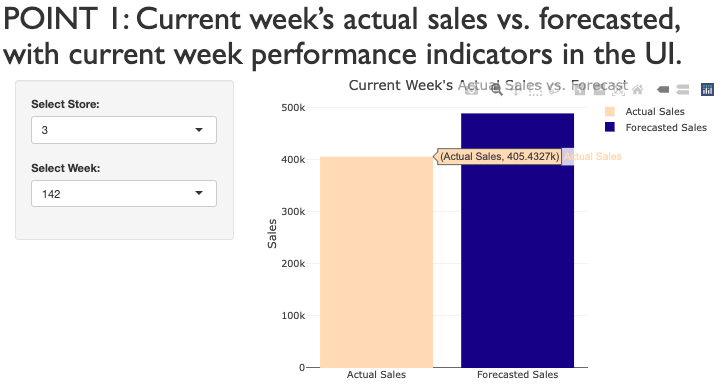
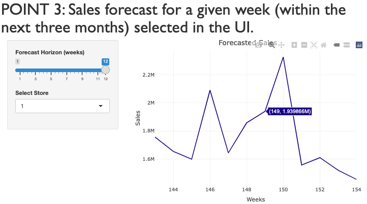
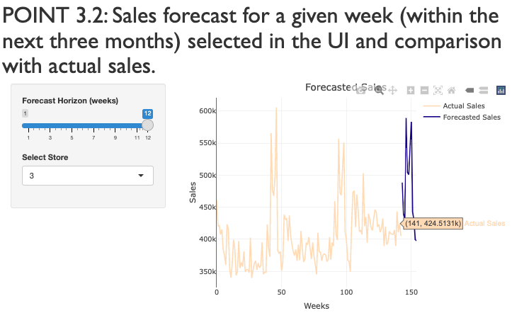
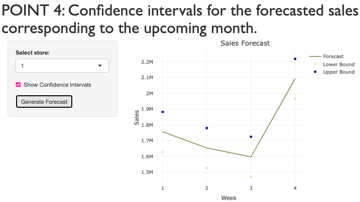
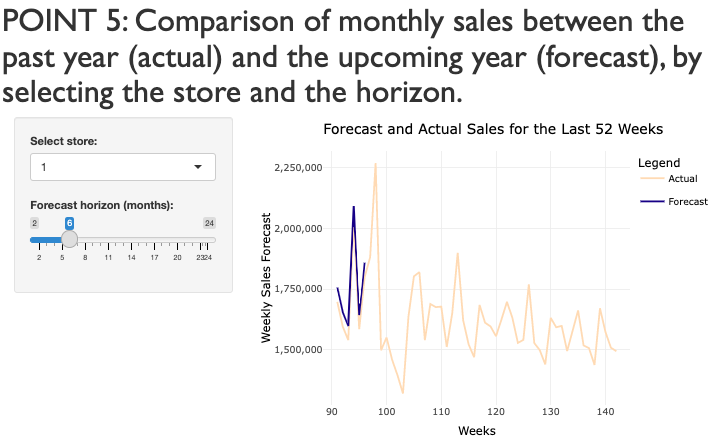

```{r setup, include=FALSE}
knitr::opts_chunk$set(echo = TRUE)
```

# [POINT 1: Current week's actual sales vs. forecasted, with current week performance indicators in the UI.]{style="font-family: Gill Sans; font-size: 40px;"}



# [POINT 2: Sales forecast for a specific future quarter (during the upcoming year) selected in the UI.]{style="font-family: Gill Sans; font-size: 40px;"}


# \# [POINT 3: Sales forecast for a given week (within the next three months) selected in the UI.]{style="font-family: Gill Sans; font-size: 40px;"}


# [POINT 3.2: Sales forecast for a given week (within the next three months) selected in the UI and comparison with actual sales.]{style="font-family: Gill Sans; font-size: 40px;"}



# [POINT 4: Confidence intervals for the forecasted sales corresponding to the upcoming month.]{style="font-family: Gill Sans; font-size: 40px;"}



# [POINT 5: Comparison of monthly sales between the past year (actual) and the upcoming year (forecast), by selecting the store and the horizon.]{style="font-family: Gill Sans; font-size: 40px;"}


